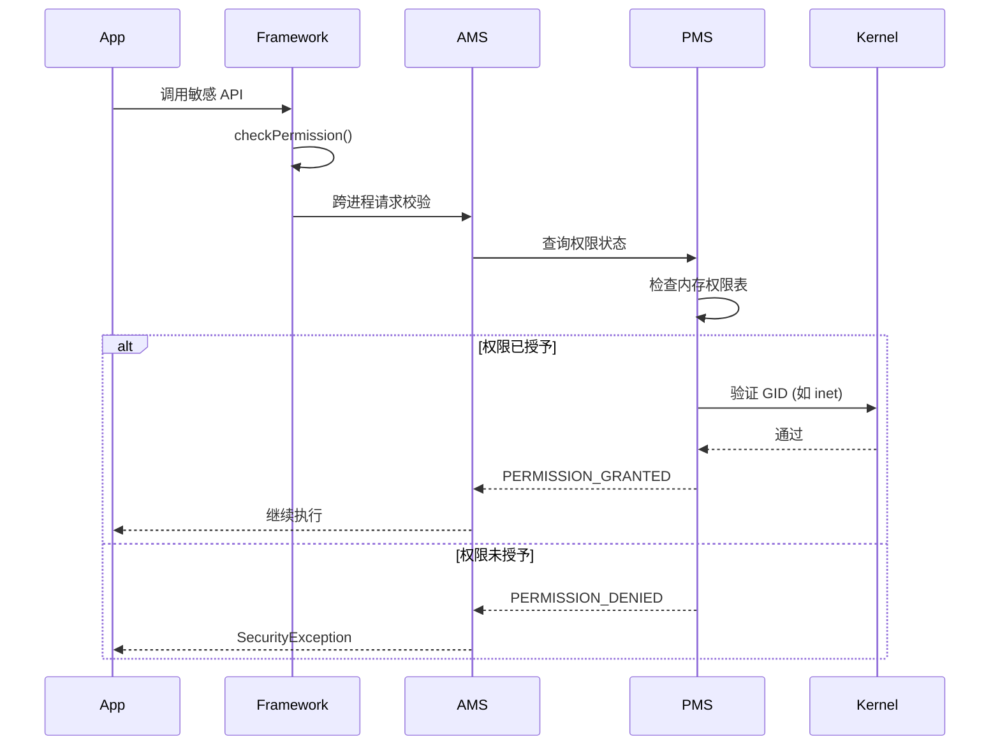

# 1x02 - 权限模型演进

Android 的权限模型经历了从“全家桶式授予”到“按需动态申请”的重大演进。它是应用沙箱在业务逻辑层面的延伸。

## 1. 权限等级 (Protection Levels)

Android 将权限分为四个主要等级，决定了系统如何授予这些权限：

- **Normal (普通权限)**: 风险较低，安装时自动授予（如访问网络、设置闹钟）。
- **Dangerous (危险权限)**: 涉及用户隐私（如摄像头、联系人、位置）。必须在运行时由用户明确授权。
- **Signature (签名权限)**: 只有当请求权限的应用与声明权限的应用签名相同时，系统才会授予。常用于系统应用间的私密通信。
- **Privileged (特权权限)**: 预装在系统分区（如 `/system/priv-app`）的应用才能申请。

## 2. 权限到 GID 的映射机制

在底层，许多权限最终会转化为 Linux 的 **GID (Group ID)**。

### 2.1 `platform.xml` 的作用
系统配置文件 `/etc/permissions/platform.xml` 定义了权限与 GID 的映射关系：

```xml
<permission name="android.permission.INTERNET" >
    <group gid="inet" />
</permission>
<permission name="android.permission.READ_EXTERNAL_STORAGE" >
    <group gid="sdcard_r" />
</permission>
```

当应用被授予 `INTERNET` 权限时，它的进程会被加入到 `inet` 组（GID 3003）。内核根据进程的 GID 列表来决定其是否可以打开网络 Socket。

## 3. 运行时权限 (Android 6.0+)

从 Android 6.0 (API 23) 开始，危险权限不再在安装时授予，而是在应用运行时弹出对话框。

- **底层实现**: 权限状态存储在 `settings.xml` 中。当用户点击“允许”时，`PermissionManagerService` 会更新该应用的权限位。
- **撤销机制**: 用户可以随时在设置中撤销权限。系统会通过重启应用进程来确保权限变更立即生效（因为 GID 列表只能在进程创建时设置）。

## 4. 权限审计：`dumpsys package`

安全研究员可以使用 `adb` 工具快速查看应用的权限状态：

```bash
# 查看特定应用的权限授予情况
adb shell dumpsys package com.example.app | grep -A 20 "requested permissions"
```

输出示例：
```text
requested permissions:
  android.permission.CAMERA
  android.permission.RECORD_AUDIO
install permissions:
  android.permission.INTERNET: granted=true
runtime permissions:
  android.permission.CAMERA: granted=false, flags=[ USER_SET ]
  android.permission.RECORD_AUDIO: granted=true, flags=[ USER_SET ]
```

## 5. 权限校验流程：从 `checkPermission` 到 PMS

当应用尝试执行敏感操作（如访问摄像头）时，系统会进行权限校验：



关键步骤：

1. **API 调用**: 应用调用 Framework 接口。
2. **ContextImpl**: 内部调用 `checkPermission()`。
3. **ActivityManagerService (AMS)**: 跨进程请求 AMS 进行校验。
4. **PermissionManagerService (PMS)**: AMS 最终查询 PMS。PMS 会检查内存中的权限表，判断该 UID 是否拥有目标权限。
5. **结果返回**: 如果未授权，抛出 `SecurityException`。

## 6. CVE 案例分析：CVE-2021-0691 (权限绕过)

该漏洞存在于 `PermissionController` 的自动授权流程中。

### 6.1 漏洞原理

在 Android 11 中，系统为某些特殊场景（如设备管理器、辅助功能服务）提供了"预授权"机制。`PermissionController` 会根据应用的角色（Role）自动授予相关权限。

漏洞的触发条件：

1. 攻击者安装一个恶意应用，声明了某个需要预授权的角色（如 `ROLE_SMS`）。
2. 在调用 `grantRuntimePermissions()` 时，`PermissionController` 会查询 `RoleManager` 获取该角色对应的包名。
3. 由于 RoleManager 的查询结果可以被 IPC 中间人攻击（通过 Intent 重定向），攻击者可以伪造一个"系统推荐的 SMS 应用"身份。
4. `PermissionController` 未对返回的包名进行 UID 一致性校验，直接为攻击者应用授予了 `READ_SMS`、`SEND_SMS` 等危险权限。

### 6.2 攻击演示

```java
// 攻击者在 Manifest 中声明
<intent-filter>
    <action android:name="android.app.role.action.REQUEST_ROLE" />
    <category android:name="android.intent.category.DEFAULT" />
</intent-filter>

// 拦截系统的 Role 查询请求，返回伪造的包名
Intent fakeIntent = new Intent();
fakeIntent.putExtra("android.app.extra.ROLE_NAME", "android.app.role.SMS");
fakeIntent.putExtra("android.intent.extra.PACKAGE_NAME", "com.attacker.app");
startActivity(fakeIntent);
```

### 6.3 修复方案

Google 在 `PermissionController` 中添加了多层防护：

1. 在授予权限前，通过 `PackageManager.getPackageUid()` 验证包名与调用方 UID 是否匹配。
2. 对 `RoleManager` 的返回结果进行签名校验，确保只有系统签名的应用才能声明敏感角色。
3. 引入了 `GRANT_RUNTIME_PERMISSIONS` 系统权限，限制普通应用无法触发自动授权流程。

## 7. Canyie (残页) 相关 CVE

> GitHub: https://github.com/canyie | Blog: https://blog.canyie.top

以下是 Canyie 发现的与权限/信息泄露相关的漏洞：

| CVE | 类型 | 简介 | 公告 |
|-----|------|------|------|
| CVE-2024-43090 | ID/High | 权限状态信息泄露，可探测其他应用的权限授予情况 | [ASB 2024-11](https://source.android.com/docs/security/bulletin/2024-11-01) |
| CVE-2025-0076 | ID/High | Framework 层敏感数据泄露，可获取其他用户/应用的私有信息 | [ASB 2025-02](https://source.android.com/docs/security/bulletin/2025-02-01) |
| CVE-2025-48545 | ID/High | Framework 信息泄露，跨用户数据访问 | [ASB 2025-06](https://source.android.com/docs/security/bulletin/2025-06-01) |

> **注**：ID = Information Disclosure，常见利用场景包括：绕过 ASLR、探测应用安装状态、泄露用户隐私数据、为后续提权收集信息。

## 参考（AOSP）

- https://source.android.com/docs/core/permissions — Android 权限架构总览：权限类型、声明与检查机制。
- https://source.android.com/docs/core/permissions/runtime_perms — 运行时权限：实现细节、UID 映射与权限组。
- 应用沙盒（权限与 UID/DAC、SELinux、存储等保护机制的整体关系）：https://source.android.com/docs/security/app-sandbox
- 架构概览（系统服务/框架层与系统 API 的层级关系）：https://source.android.com/docs/core/architecture
