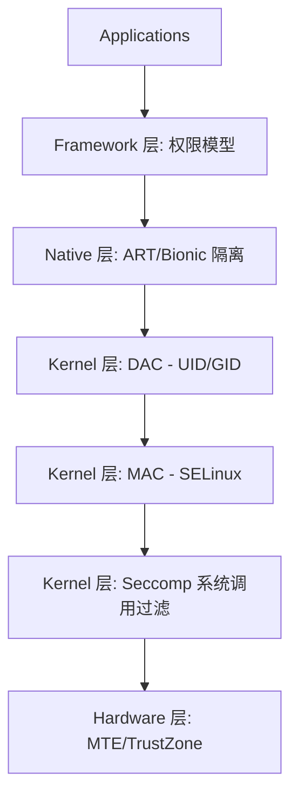

# Part 1: Sandbox

Android 沙箱机制是整个系统安全架构的基石。它的核心目标是实现**应用隔离**：确保应用 A 无法在未经授权的情况下访问应用 B 的数据，也无法随意操控系统资源。

## 1. 沙箱的纵深防御体系

现代 Android 的沙箱由多个层级的技术栈共同构建，每一层都在不同的维度提供保护：

1.  **DAC (自主访问控制)**: 基于 Linux 传统的 UID/GID 机制，防止“邻居”应用互相偷窥。
2.  **MAC (强制访问控制)**: 基于 SELinux，防止进程越权访问敏感系统资源，即使是 Root 进程也受其约束。
3.  **Seccomp**: 限制进程可调用的系统调用（Syscalls），收窄内核攻击面。
4.  **Scoped Storage**: 针对存储空间的细粒度隔离，终结了“全盘读写 SD 卡”的混乱时代。

## 2. 为什么沙箱会失效？

尽管有如此严密的保护，沙箱依然可能被突破。常见的攻击路径包括：
- **系统服务漏洞**: 利用 `system_server` 或其他高权限 Native Daemon 的内存破坏漏洞实现提权。
- **内核漏洞**: 通过内核提权直接关闭 SELinux 或修改进程凭证。
- **逻辑漏洞**: 利用 Framework 层的逻辑缺陷（如 Intent 重定向、PendingIntent 劫持）绕过权限检查。

后续章节将详细分析这些防御机制的实现细节与绕过思路。

## 参考（AOSP）

- **应用沙盒**：https://source.android.com/docs/security/app-sandbox
- **SELinux**：https://source.android.com/docs/security/features/selinux
- **Zygote 与进程孵化**：https://source.android.com/docs/core/runtime/zygote
- **Android 运行时 (ART)**：https://source.android.com/docs/core/runtime
- **Android 架构总览**：https://source.android.com/docs/core/architecture
