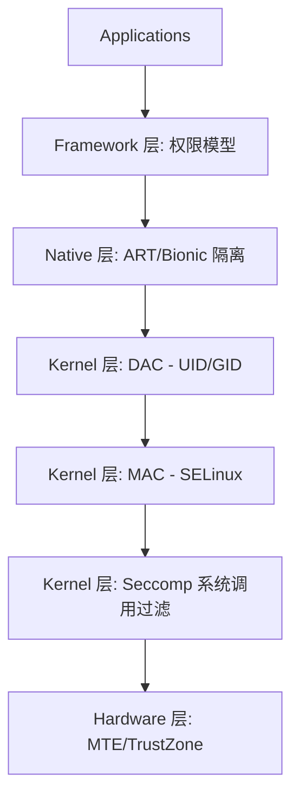

# Part 1: Sandbox

> "沙箱不是一个单一的组件，而是一套纵深防御（Defense in Depth）体系。"

Android 沙箱机制是整个系统安全架构的基石。它的核心目标是实现**应用隔离**：确保应用 A 无法在未经授权的情况下访问应用 B 的数据，也无法随意操控系统资源。

## 1. 沙箱的纵深防御体系

现代 Android 的沙箱由多个层级的技术栈共同构建，每一层都在不同的维度提供保护：

1.  **DAC (自主访问控制)**: 基于 Linux 传统的 UID/GID 机制，防止“邻居”应用互相偷窥。
2.  **MAC (强制访问控制)**: 基于 SELinux，防止进程越权访问敏感系统资源，即使是 Root 进程也受其约束。
3.  **Seccomp**: 限制进程可调用的系统调用（Syscalls），收窄内核攻击面。
4.  **Scoped Storage**: 针对存储空间的细粒度隔离，终结了“全盘读写 SD 卡”的混乱时代。

## 2. 专题章节

在本专题中，我们将深入拆解沙箱的每一个核心组件，并结合真实的 CVE 案例分析其攻防博弈：

### [1x00 - UID/GID 隔离深度解析](./01-uid-gid-isolation.md)
- **核心内容**: AID 分配机制、`installd` 源码分析、SharedUserId 的原罪。
- **CVE 案例**: CVE-2018-9468 (SharedUserId 签名验证绕过)。

### [1x01 - Zygote 与进程创建](./02-zygote-process.md)
- **核心内容**: 进程是如何从 Zygote 孵化并“降权”进入沙箱的？Capabilities 丢弃机制。
- **CVE 案例**: CVE-2020-0096 (StrandHogg 2.0 - Activity 栈劫持)。

### [1x02 - 权限模型演进](./03-permission-model.md)
- **核心内容**: 从安装时权限到运行时权限，底层 GID 映射与 `platform.xml`。
- **CVE 案例**: CVE-2021-0691 (权限绕过漏洞)。

### [1x03 - 存储隔离 (Scoped Storage)](./04-storage-isolation.md)
- **核心内容**: 存储权限的“黑暗时代”与“现代文明”，MediaStore 与 SAF。
- **CVE 案例**: 路径遍历与符号链接攻击系列。

### [1x04 - 四大组件安全](./05-app-components.md)
- **核心内容**: Activity/Service/Receiver/Provider 的边界安全与常见漏洞模式。
- **CVE 案例**: CVE-2018-9581 (Broadcast 信息泄露)。

## 3. 为什么沙箱会失效？

尽管有如此严密的保护，沙箱依然可能被突破。常见的攻击路径包括：
- **系统服务漏洞**: 利用 `system_server` 或其他高权限 Native Daemon 的内存破坏漏洞实现提权。
- **内核漏洞**: 通过内核提权直接关闭 SELinux 或修改进程凭证。
- **逻辑漏洞**: 利用 Framework 层的逻辑缺陷（如 Intent 重定向、PendingIntent 劫持）绕过权限检查。

后续章节将详细分析这些防御机制的实现细节与绕过思路。

## 延伸阅读
- [0x01 - Android 架构演进](../00-foundation/01-architecture-overview.md)
- [Android 官方文档：应用沙箱](https://source.android.com/docs/security/app-sandbox)
